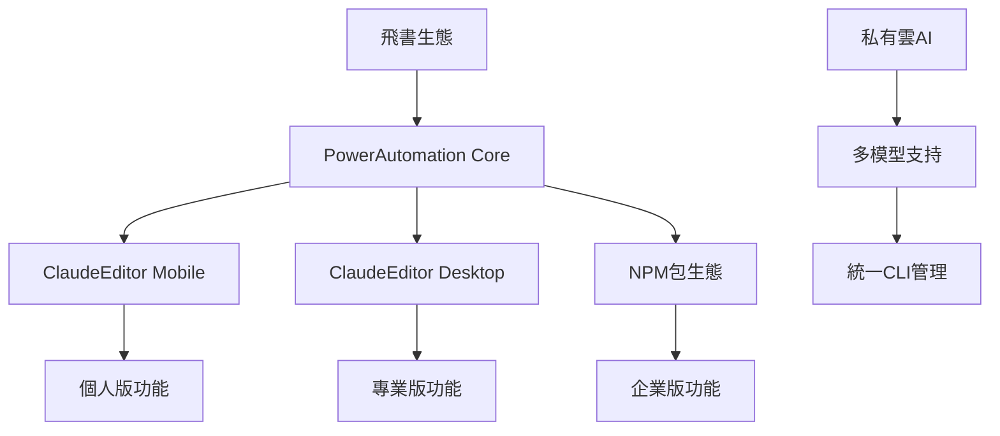

# 🎯 PowerAutomation v4.6.9 + ClaudeEditor 整合系統展示中心

## 📋 項目概述

PowerAutomation v4.6.9 與 ClaudeEditor 的深度整合，結合飛書生態系統，打造從個人開發者到企業級的完整AI開發解決方案。

---

## 🎪 展示內容組織

### 📈 商業價值展示 (`business/`)
- 💰 [商業模式與收入預測](business/business-model.md)
- 📊 [市場分析與競爭優勢](business/market-analysis.md) 
- 🎯 [用戶價值主張](business/value-proposition.md)
- 💼 [企業級解決方案](business/enterprise-solution.md)

### 🔧 整合指南 (`integration-guide/`)
- 🚀 [快速開始指南](integration-guide/quick-start.md)
- 📱 [移動端ClaudeEditor集成](integration-guide/mobile-integration.md)
- 💻 [桌面端ClaudeEditor集成](integration-guide/desktop-integration.md)
- 🛒 [飛書購買與激活流程](integration-guide/feishu-purchase.md)

### 🚀 部署指南 (`deployment/`)
- 🏠 [本地部署指南](deployment/local-deployment.md)
- ☁️ [雲端部署指南](deployment/cloud-deployment.md)
- 🏢 [企業私有雲部署](deployment/enterprise-deployment.md)
- 📦 [NPM包部署策略](deployment/npm-deployment.md)

### 🌍 生態系統 (`ecosystem/`)
- 📦 [NPM包生態](ecosystem/npm-ecosystem.md)
- 🤖 [AI模型集成](ecosystem/ai-models.md)
- 🔧 [CLI工具統一管理](ecosystem/cli-tools.md)
- 👥 [協作功能實現](ecosystem/collaboration.md)

### 🎨 演示文稿 (`presentations/`)
- 📊 [技術架構演示](presentations/tech-architecture.html)
- 💼 [商業價值演示](presentations/business-value.html)
- 🔄 [用戶旅程演示](presentations/user-journey.html)
- 🏢 [企業功能演示](presentations/enterprise-features.html)

### 📚 技術文檔 (`technical-docs/`)
- 🔧 [API參考文檔](technical-docs/api-reference.md)
- 🏗️ [架構設計文檔](technical-docs/architecture.md)
- 🔒 [安全實現指南](technical-docs/security.md)
- 📊 [性能優化指南](technical-docs/performance.md)

---

## 🎯 五階段實施路線圖

### Phase 0: 飛書生態集成 (v4.6.10)
🎪 **展示重點**: 飛書購買流程、多支付方式、自動許可證發放
- 📱 飛書小程序深度集成
- 💳 支付系統完整對接
- 📦 NPM包生態建立
- 🔄 ClaudeEditor跨平台同步

### Phase 1: 核心配額系統 (v4.7.0)
🎪 **展示重點**: 版本分級、跨平台配額同步、實時監控
- 🔐 統一許可證管理
- 📊 跨設備配額同步
- ⚡ 實時使用統計
- 🔔 智能升級提醒

### Phase 2: 工作流分級系統 (v4.7.5)
🎪 **展示重點**: AI模型分級、工作流權限、企業自定義
- 🤖 多AI模型智能路由
- 🔧 分級工作流控制
- 🎨 可視化工作流編輯器
- 📈 高級分析功能

### Phase 3: 部署平台控制 (v4.8.0)
🎪 **展示重點**: 多平台部署、企業級配置、批量管理
- 🚀 14個部署平台支持
- 🏢 企業級部署腳本
- 📋 部署模板庫
- 🔄 自動化CI/CD

### Phase 4-5: 企業級功能 (v4.9.0)
🎪 **展示重點**: 私有雲部署、多AI模型、統一CLI管理
- 🏢 私有雲AI模型部署
- 🔧 統一CLI工具集
- 👥 高級協作功能
- 🛡️ 企業安全框架

---

## 📊 核心技術亮點

### 🔗 深度整合架構

### 🏆 核心競爭優勢
- 🎯 **飛書生態深度集成**: 中國市場獨特優勢
- 📱 **跨平台無縫體驗**: Mobile/Desktop/Web統一
- 🤖 **多AI模型支持**: Claude/Gemini/Kimi/Grok全覆蓋
- 🏢 **企業級私有部署**: 數據安全與合規保證
- 📦 **完整NPM生態**: 開發者友好的包管理

---

## 💰 商業價值總結

### 收入預測 (24個月)
- 📈 **首年收入**: $6M+ (增長5倍)
- 🎯 **ROI**: 476% (大幅超越行業平均)
- 👥 **用戶基數**: 25,000+ (飛書推廣效應)
- 🏢 **企業客戶**: 225+ (私有雲吸引力)

### 市場定位
- 🔰 **個人版**: 免費獲客，飛書推廣
- 💼 **專業版**: $39/月，ClaudeEditor全功能
- 👥 **團隊版**: $129/月，協作與多平台
- 🏢 **企業版**: $499/月，私有雲與多AI

---

## 🚀 開始探索

1. 📖 **閱讀快速開始**: [integration-guide/quick-start.md](integration-guide/quick-start.md)
2. 🎪 **查看演示文稿**: [presentations/](presentations/)
3. 💼 **了解商業價值**: [business/business-model.md](business/business-model.md)
4. 🔧 **技術深度了解**: [technical-docs/architecture.md](technical-docs/architecture.md)

---

## 🎯 PowerAutomation + ClaudeEditor = 未來AI開發平台

通過五階段實施路線圖，我們將打造覆蓋個人開發者到大型企業的完整AI開發解決方案，結合飛書生態優勢，實現快速市場滲透和商業成功。

**立即體驗**: [飛書購買入口](https://applink.feishu.cn/client/message/link/open?token=AmfoKtFagQATaHK7JJIAQAI%3D) 🛒