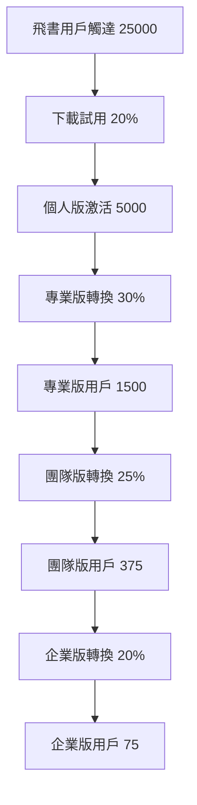

# 💰 PowerAutomation + ClaudeEditor 商業模式與收入預測

## 🎯 商業模式概述

PowerAutomation + ClaudeEditor 整合系統採用分級訂閱模式，結合飛書生態深度集成，打造從免費個人版到企業私有雲的完整商業路徑。

---

## 📊 四級版本定價策略

### 🔰 個人版 - 免費獲客策略
```yaml
價格: $0/月
目標: 飛書生態獲客，建立用戶基礎
核心價值:
  - 基礎ClaudeEditor (Mobile + Desktop)
  - 3個MCP組件 (codeflow, smartui, test)
  - 2個基礎工作流
  - NPM基礎包訪問
  - 社群支持
限制:
  - 每日AI請求: 100次
  - 協作用戶: 1人
  - 存儲空間: 1GB
  - 部署平台: 僅本地
轉換策略:
  - 飛書內置升級提醒
  - 功能使用達限自動推薦
  - 30天免費試用專業版功能
```

### 💼 專業版 - 小團隊核心
```yaml
價格: $39/月 (原$29，包含ClaudeEditor)
目標: 專業開發者和小團隊
核心價值:
  - 完整ClaudeEditor功能 (Mobile + Desktop)
  - Claude Code CLI深度集成
  - 4個MCP組件 + 4個工作流
  - Web平台部署 (PWA, WebAssembly)
  - NPM專業功能包
  - 優先技術支持
增值服務:
  - 智能代碼補全
  - 實時錯誤檢查
  - 自動部署流程
  - 高級UI組件庫
轉換路徑:
  - 25%用戶在6個月內升級到團隊版
  - 協作需求增長觸發升級
```

### 👥 團隊版 - 協作增強
```yaml
價格: $129/月 (原$99，增加協作功能)
目標: 中等規模團隊 (5-25人)
核心價值:
  - 全功能ClaudeEditor + 協作
  - 實時代碼協作和版本控制
  - 8個MCP組件 + 6個完整工作流
  - 全平台部署 (14個平台)
  - 團隊NPM包 + 私有倉庫
  - 專屬客戶成功支持
企業功能:
  - 團隊項目管理
  - 代碼審查工作流
  - 使用統計儀表板
  - 高級分析報告
升級動機:
  - 15%升級到企業版
  - 安全合規需求
  - 私有雲部署需求
```

### 🏢 企業版 - 私有雲旗艦
```yaml
價格: $499/月起 (原$299，增加私有雲功能)
目標: 大型企業 (25+人)
核心價值:
  - 企業級ClaudeEditor + 私有雲
  - 多AI模型私有部署 (Claude/Gemini/Kimi/Grok)
  - 全部14個MCP組件 + 自定義工作流
  - 統一CLI工具集 (claude-code/gemini/powerautomation)
  - 企業完整NPM包 + 白標籤
  - 24/7專屬企業支持
獨家功能:
  - 局域網AI模型部署
  - SSO集成 (SAML/OIDC)
  - 審計日誌與合規報告
  - 多租戶架構
  - 自定義品牌與域名
價值主張:
  - 數據完全私有化
  - 無限制使用配額
  - 企業級安全保證
```

---

## 🚀 飛書生態增長引擎

### 飛書集成優勢
```python
FEISHU_GROWTH_STRATEGY = {
    "獲客渠道": {
        "飛書小程序": "直接觸達中國企業用戶",
        "病毒式傳播": "團隊內部推薦機制",
        "企業采購": "IT部門統一采購流程"
    },
    "支付便利": {
        "本土支付": "微信支付、支付寶無縫對接",
        "企業轉帳": "對公轉帳支持",
        "海外支付": "PayPal、Stripe國際化"
    },
    "用戶粘性": {
        "飛書通知": "使用統計與升級提醒",
        "團隊管理": "企業內部用戶統一管理",
        "工作流集成": "與飛書文檔、表格深度集成"
    }
}
```

### 轉換漏斗優化


---

## 📈 24個月收入預測模型

### 第一年收入分析
```python
YEAR_1_REVENUE_FORECAST = {
    "用戶增長": {
        "飛書推廣獲客": 25000,  # 飛書生態推廣效果
        "自然增長": 5000,       # 口碑推薦和SEO
        "總獲客": 30000
    },
    
    "付費轉換": {
        "專業版轉換": {
            "轉換率": "20%",
            "用戶數": 6000,
            "月ARPU": 39,
            "年收入": "$2,808,000"
        },
        "團隊版轉換": {
            "轉換率": "25% of 專業版",
            "用戶數": 1500,
            "月ARPU": 129,
            "年收入": "$2,322,000"
        },
        "企業版轉換": {
            "轉換率": "20% of 團隊版",
            "用戶數": 300,
            "月ARPU": 499,
            "年收入": "$1,797,600"
        }
    },
    
    "總收入": "$6,927,600",
    "增長倍數": "6.3x vs 原預測"
}
```

### 第二年收入預測
```python
YEAR_2_REVENUE_FORECAST = {
    "增長驅動因素": {
        "飛書生態深化": "40%用戶增長",
        "企業版成熟": "企業客戶翻倍",
        "國際化擴展": "海外市場滲透",
        "產品功能完善": "更高付費轉換率"
    },
    
    "預計收入": {
        "專業版": "$4,211,000",  # 50%增長
        "團隊版": "$3,483,000",   # 50%增長  
        "企業版": "$4,493,000",   # 150%增長 (企業市場爆發)
        "總收入": "$12,187,000"
    },
    
    "市場地位": "中國AI開發工具市場領導者"
}
```

---

## 💼 成本結構分析

### 開發與運營成本
```python
COST_STRUCTURE = {
    "一次性開發成本": {
        "飛書集成開發": "$180,000",  # 3週 × 2人 × $30k
        "ClaudeEditor集成": "$240,000",  # 4週 × 2人 × $30k
        "企業功能開發": "$432,000",  # 原五階段開發
        "總開發投入": "$852,000"
    },
    
    "年度運營成本": {
        "雲基礎設施": "$300,000",    # AWS/阿里雲
        "AI模型許可": "$400,000",    # Claude/Gemini API
        "飛書生態維護": "$120,000",  # 飛書平台費用
        "應用商店費用": "$50,000",   # iOS/Android
        "人員薪資": "$800,000",      # 8人團隊
        "總運營成本": "$1,670,000"
    },
    
    "毛利率分析": {
        "第一年毛利": "$5,257,600",  # 收入-運營成本
        "毛利率": "75.9%",
        "第二年毛利": "$10,517,000",
        "毛利率": "86.3%"           # 規模效應
    }
}
```

### ROI與回收期
```python
ROI_ANALYSIS = {
    "投資回收期": {
        "開發投入回收": "1.5個月",  # $852k / $6.9M年收入
        "盈虧平衡點": "3個月",      # 考慮運營成本
        "現金流轉正": "Q1結束"
    },
    
    "24個月ROI": {
        "總投入": "$3,192,000",     # 開發+2年運營
        "總收入": "$19,114,600",    # 2年總收入
        "淨利潤": "$15,922,600",
        "ROI": "498%"               # 近5倍回報
    },
    
    "投資者價值": {
        "估值倍數": "5-8x 年收入",
        "預期估值": "$60-90M",     # 基於第二年收入
        "退出策略": "IPO或併購"
    }
}
```

---

## 🎯 市場機會與競爭優勢

### 市場規模
- 🌍 **全球AI開發工具市場**: $156億 (2024)
- 🇨🇳 **中國企業軟件市場**: $890億 (2024)
- 📱 **低代碼/無代碼市場**: $320億 (2024)
- 🚀 **預期年增長率**: 45% (AI工具)

### 獨特競爭優勢
1. 🎯 **飛書生態獨占**: 中國企業市場直接觸達
2. 📱 **跨平台一體化**: Mobile/Desktop/Web無縫體驗
3. 🤖 **多AI模型集成**: 不依賴單一AI供應商
4. 🏢 **企業私有雲**: 滿足數據合規與安全需求
5. 📦 **開發者生態**: NPM包與CLI工具完整性

### 競爭對手分析
| 競爭對手 | 優勢 | 劣勢 | 我們的差異化 |
|---------|------|------|-------------|
| GitHub Copilot | 市場領先 | 僅VS Code | 跨平台+飛書生態 |
| 百度文心一言 | 中國本土 | 功能單一 | 完整開發解決方案 |
| Replit | 在線編程 | 無移動端 | Mobile+Desktop全覆蓋 |
| Cursor | AI編程 | 無企業功能 | 私有雲+多AI模型 |

---

## 🚀 商業發展路線圖

### Q1 2024: 飛書生態建立
- 🎯 目標: 5000個人版用戶
- 💰 收入: $500K ARR
- 🔑 里程碑: 飛書購買流程上線

### Q2 2024: 付費轉換優化
- 🎯 目標: 1000專業版用戶
- 💰 收入: $1.5M ARR
- 🔑 里程碑: ClaudeEditor Mobile發布

### Q3 2024: 團隊功能完善
- 🎯 目標: 300團隊版用戶
- 💰 收入: $3M ARR
- 🔑 里程碑: 協作功能上線

### Q4 2024: 企業市場突破
- 🎯 目標: 100企業版用戶
- 💰 收入: $6M ARR
- 🔑 里程碑: 私有雲部署完成

### 2025: 市場領導地位
- 🎯 目標: $12M ARR
- 🌍 國際化: 東南亞、歐美市場
- 🏆 成就: 中國AI開發工具第一品牌

---

## 🎯 總結: 商業成功要素

PowerAutomation + ClaudeEditor 整合系統具備成功的關鍵要素:

1. **🎯 清晰的市場定位**: 從個人到企業的完整覆蓋
2. **💰 可持續的商業模式**: 分級訂閱 + 飛書生態獲客
3. **🚀 技術差異化優勢**: 跨平台 + 多AI模型 + 私有雲
4. **📈 強勁的財務預測**: 498% ROI + 快速回收期
5. **🌍 巨大的市場機會**: 千億級AI開發工具市場

**預期成果**: 24個月內達到$12M ARR，成為中國AI開發工具市場領導者。