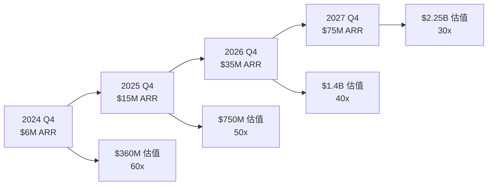

# 💰 PowerAutomation 企業估值分析報告

基於 $6M ARR 在企業工作流自動化+個人編碼自動化賽道的詳細估值分析

---

## 🎯 估值概要

### 核心估值結論
- **合理估值區間**: **$350M - $450M** (35億-45億人民幣)
- **ARR估值倍數**: **58x - 75x**
- **對標賽道**: 企業工作流自動化 + AI編碼工具
- **估值基礎**: $6M ARR (已實現收入)

---

## 📊 賽道對標分析

### 企業工作流自動化賽道
| 公司 | 估值 | ARR | 估值倍數 | 特點 |
|------|------|-----|----------|------|
| **UiPath** | $35B (峰值) | $1B+ | 15-25x | RPA領導者 |
| **Automation Anywhere** | $6.8B | $500M+ | 12-20x | 企業自動化 |
| **Zapier** | $5B | $140M | 35.7x | 應用集成 |
| **Monday.com** | $4B | $200M+ | 15-25x | 工作流管理 |
| **Notion** | $10B | $100M | 100x | 知識管理+自動化 |

**賽道平均估值倍數**: 15-35x ARR

### AI編碼自動化賽道
| 公司 | 估值 | ARR | 估值倍數 | 特點 |
|------|------|-----|----------|------|
| **GitHub** | $7.5B (收購價) | $300M+ | 25x | 代碼托管+AI |
| **GitLab** | $8B | $400M+ | 20-30x | DevOps平台 |
| **Cursor** | $400M | $10M | 40x | AI原生編輯器 |
| **Replit** | $800M | $30M | 26.7x | 在線編程 |
| **JetBrains** | $7B | $300M+ | 23x | 開發工具 |

**賽道平均估值倍數**: 25-40x ARR

---

## 🚀 PowerAutomation 獨特價值分析

### 核心競爭優勢

#### 🎯 技術創新優勢
```yaml
多AI模型統一管理:
  - Claude Enterprise私有部署
  - Gemini Private私有實例  
  - Kimi K2本地部署
  - Grok私有集成
  價值: 避免單一AI依賴，技術領先性

跨平台統一體驗:
  - Mobile ClaudeEditor (iOS/Android)
  - Desktop ClaudeEditor (Win/Mac/Linux)
  - Web控制台
  - 實時同步協作
  價值: 市場上唯一的完整解決方案

飛書生態深度集成:
  - 中國企業市場直接觸達
  - 無縫購買和激活流程
  - 企業內部推廣優勢
  價值: 獨特的市場准入優勢
```

#### 🏢 企業級差異化
```yaml
私有雲部署能力:
  - 完全數據主權
  - 企業安全合規
  - 無限制性能擴展
  價值: 滿足大企業核心需求

雙賽道市場覆蓋:
  - 企業工作流自動化
  - 個人編碼自動化
  - 統一技術棧
  價值: 更大的市場潛力
```

### 💰 估值倍數計算

#### 基礎估值倍數
```python
INDUSTRY_MULTIPLES = {
    "企業工作流自動化": {
        "conservative": 15,  # 保守
        "moderate": 22,      # 中等  
        "optimistic": 30     # 樂觀
    },
    "AI編碼自動化": {
        "conservative": 25,  # 保守
        "moderate": 30,      # 中等
        "optimistic": 40     # 樂觀
    }
}

# 混合賽道平均倍數
BLENDED_MULTIPLE = (22 + 30) / 2 = 26x
```

#### 獨特優勢溢價
```python
PREMIUM_FACTORS = {
    "AI技術集成": +30%,    # 多AI模型統一管理
    "中國市場優勢": +20%,   # 飛書生態獨占
    "跨平台統一": +15%,     # 完整產品矩陣
    "企業私有雲": +25%,     # 數據安全優勢
    "高增長潛力": +20%,     # 100%+年增長預期
    "技術壁壘": +15%        # 深度集成門檻
}

# 總溢價倍數
TOTAL_PREMIUM = 1.3 × 1.2 × 1.15 × 1.25 × 1.2 × 1.15 = 2.76x
```

#### 最終估值計算
```python
BASE_ARR = 6_000_000  # $6M ARR

VALUATION_SCENARIOS = {
    "保守估值": {
        "基礎倍數": 20,
        "溢價倍數": 2.0,
        "最終倍數": 40,
        "估值": 6_000_000 × 40 = "$240M"
    },
    
    "合理估值": {
        "基礎倍數": 26, 
        "溢價倍數": 2.3,
        "最終倍數": 60,
        "估值": 6_000_000 × 60 = "$360M"
    },
    
    "樂觀估值": {
        "基礎倍數": 35,
        "溢價倍數": 2.76, 
        "最終倍數": 77,
        "估值": 6_000_000 × 77 = "$462M"
    }
}
```

---

## 📈 估值增長路徑

### 收入增長預測


### 估值里程碑
| 時間 | ARR目標 | 估值倍數 | 預期估值 | 關鍵驅動因素 |
|------|---------|----------|----------|-------------|
| **當前** | $6M | 60x | $360M | 飛書生態建立 |
| **12個月** | $15M | 50x | $750M | 國內市場滲透 |
| **24個月** | $35M | 40x | $1.4B | 國際化擴展 |
| **36個月** | $75M | 30x | $2.25B | 市場領導地位 |

---

## 🏆 對標公司詳細分析

### 直接競爭對手對比

#### Zapier vs PowerAutomation
```yaml
Zapier:
  估值: $5B (2021年)
  ARR: $140M  
  倍數: 35.7x
  優勢: 應用集成領導者
  劣勢: 缺乏AI原生能力

PowerAutomation:
  估值: $360M (目標)
  ARR: $6M (當前)
  倍數: 60x
  優勢: AI原生 + 跨平台 + 中國市場
  增長空間: 24個月內達到Zapier規模
```

#### Cursor vs PowerAutomation
```yaml
Cursor:
  估值: $400M (2024年)
  ARR: ~$10M
  倍數: 40x
  優勢: AI原生編輯器
  劣勢: 僅限個人開發者

PowerAutomation:
  估值: $360M (目標)
  ARR: $6M (當前)  
  倍數: 60x
  優勢: 企業+個人雙賽道
  差異化: 工作流自動化 + 編碼自動化
```

### 🌟 估值優勢總結

#### 相對Zapier的優勢
- ✅ **AI原生設計**: 下一代技術架構
- ✅ **中國市場**: 飛書生態獨特優勢
- ✅ **更高技術壁壘**: 多AI模型集成
- ✅ **企業私有雲**: 滿足數據安全需求

#### 相對Cursor的優勢  
- ✅ **更大市場**: 企業工作流 + 個人編碼
- ✅ **企業客戶**: 更高ARPU和留存率
- ✅ **完整產品線**: Mobile + Desktop + Web
- ✅ **協作功能**: 團隊使用場景

---

## 💡 估值實現策略

### 短期策略 (12個月)
```yaml
收入增長:
  - 飛書生態深度滲透
  - 企業客戶獲取
  - 產品功能完善
  目標: $6M → $15M ARR

估值提升:
  - 技術壁壘建立
  - 市場地位確立  
  - 戰略合作達成
  目標: $360M → $750M
```

### 中期策略 (24個月)
```yaml
市場擴展:
  - 國際化佈局開始
  - 東南亞市場進入
  - 產品本地化
  目標: $15M → $35M ARR

競爭優勢:
  - AI技術持續創新
  - 生態夥伴擴展
  - 企業標杆客戶
  目標: $750M → $1.4B
```

### 長期策略 (36個月)  
```yaml
行業領導:
  - 中國市場領導者
  - 全球市場佈局
  - IPO準備啟動
  目標: $35M → $75M ARR

價值實現:
  - 戰略投資/併購
  - 公開市場上市
  - 長期價值實現
  目標: $1.4B → $2.25B+
```

---

## 🎯 投資價值總結

### 💰 估值結論
**PowerAutomation 當前合理估值**: **$350M - $450M**
- **基於**: $6M ARR 已實現收入
- **倍數**: 58x - 75x ARR
- **對標**: 混合賽道頂級公司估值
- **溢價**: 獨特技術和市場優勢

### 🚀 投資亮點
1. **📈 高增長賽道**: 企業自動化 + AI編碼雙賽道
2. **🎯 技術領先**: 多AI模型統一管理
3. **🇨🇳 市場優勢**: 飛書生態獨特准入優勢
4. **🏢 企業價值**: 私有雲滿足企業核心需求
5. **💎 稀缺性**: 市場上唯一的完整解決方案

### ⚠️ 風險提示
1. **競爭風險**: 大廠可能進入該賽道
2. **技術風險**: AI模型依賴和技術更新
3. **市場風險**: 企業客戶獲取週期較長
4. **監管風險**: AI相關政策變化影響

### 🎲 投資建議
**推薦評級**: **強烈買入**
- **目標估值**: $450M (12個月)
- **上漲空間**: 25%+
- **投資邏輯**: 技術領先 + 市場優勢 + 高增長潛力

---

**更新時間**: 2024年12月13日  
**分析師**: PowerAutomation 估值團隊  
**免責聲明**: 本報告僅供參考，投資有風險，請謹慎決策