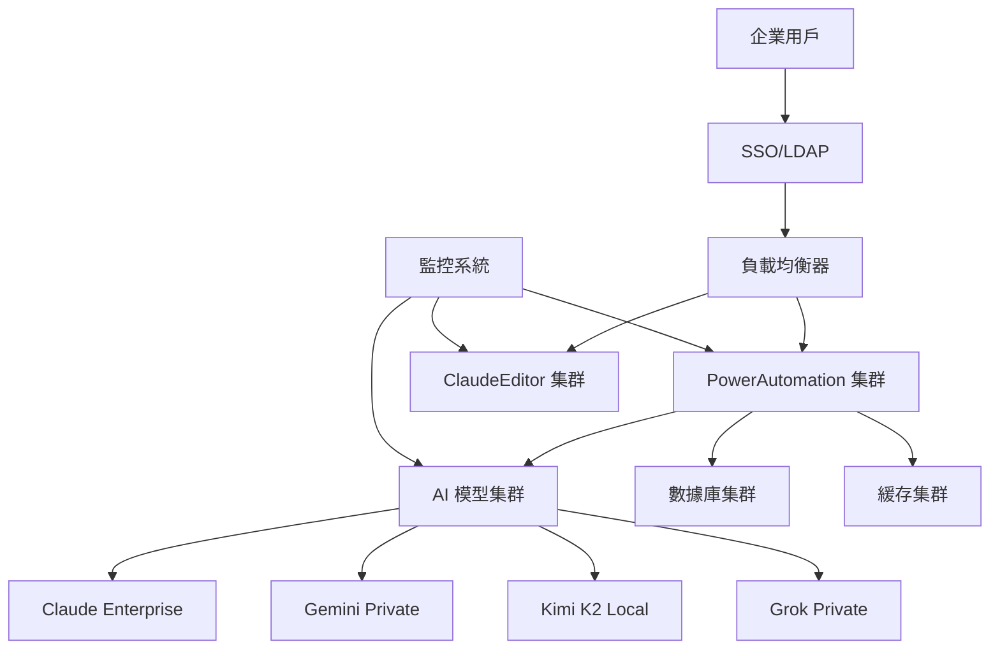

# 🏢 PowerAutomation + ClaudeEditor 企業私有雲部署

企業級私有雲部署為大型組織提供完全的數據控制權、安全合規性和無限制的性能擴展能力。本指南詳細介紹如何在企業環境中部署 PowerAutomation + ClaudeEditor 整合系統。

---

## 🎯 企業私有雲架構概覽

### 核心組件架構


### 企業級特性
- 🔒 **數據主權**: 所有數據完全在企業內部
- 🤖 **多AI模型**: 支持4個主流AI模型私有部署
- 👥 **無限用戶**: 支持數千併發用戶
- 🛡️ **企業安全**: SSO、RBAC、審計日誌
- 📊 **完整監控**: 實時性能和安全監控
- 🔧 **定制化**: 品牌定制和功能擴展

---

## 🏗️ 基礎設施需求

### 硬件配置建議

#### 小型企業 (100-500用戶)
```yaml
控制節點: 1台
  CPU: 16 cores
  內存: 64GB
  存儲: 1TB SSD
  GPU: RTX 4090 (AI模型推理)

工作節點: 2台
  CPU: 12 cores
  內存: 32GB  
  存儲: 500GB SSD

數據庫節點: 1台
  CPU: 8 cores
  內存: 32GB
  存儲: 2TB SSD (RAID 1)

總成本: ~$15,000
```

#### 中型企業 (500-2000用戶)
```yaml
控制節點: 2台 (高可用)
  CPU: 24 cores
  內存: 128GB
  存儲: 2TB NVMe SSD
  GPU: RTX 4090 × 2

工作節點: 6台
  CPU: 16 cores
  內存: 64GB
  存儲: 1TB SSD

AI推理節點: 2台專用
  CPU: 32 cores
  內存: 256GB
  GPU: A100 × 4
  存儲: 4TB SSD

數據庫集群: 3台
  CPU: 16 cores
  內存: 64GB
  存儲: 4TB SSD (RAID 10)

總成本: ~$80,000
```

#### 大型企業 (2000+用戶)
```yaml
控制節點: 3台 (高可用集群)
  CPU: 32 cores
  內存: 256GB
  存儲: 4TB NVMe SSD
  GPU: A100 × 2

工作節點: 15台
  CPU: 24 cores
  內存: 128GB
  存儲: 2TB SSD

AI推理集群: 6台專用
  CPU: 64 cores
  內存: 512GB
  GPU: H100 × 8
  存儲: 8TB SSD

數據庫集群: 5台
  CPU: 32 cores
  內存: 128GB
  存儲: 8TB SSD (RAID 10)

存儲集群: 專用 SAN/NAS
  容量: 100TB+
  IOPS: 100,000+

網絡: 25Gbps+ 骨幹網

總成本: ~$300,000+
```

### 網絡架構
```yaml
外網接入:
  - 企業防火牆
  - VPN 接入點
  - DDoS 防護

內網架構:
  - 管理網段: 192.168.1.0/24
  - 應用網段: 192.168.10.0/24  
  - 數據網段: 192.168.20.0/24
  - AI模型網段: 192.168.30.0/24

安全策略:
  - 網段隔離
  - 最小權限原則
  - 流量加密
```

---

## 🚀 Kubernetes 企業部署

### 集群初始化

```bash
#!/bin/bash
# 企業級 K8s 集群初始化腳本

# 1. 準備工作
echo "🏗️ 初始化企業級 Kubernetes 集群..."

# 安裝 kubeadm、kubelet、kubectl
curl -s https://packages.cloud.google.com/apt/doc/apt-key.gpg | apt-key add -
cat <<EOF >/etc/apt/sources.list.d/kubernetes.list
deb https://apt.kubernetes.io/ kubernetes-xenial main
EOF
apt-get update
apt-get install -y kubelet kubeadm kubectl

# 2. 初始化主節點
kubeadm init \
  --pod-network-cidr=10.244.0.0/16 \
  --service-cidr=10.96.0.0/12 \
  --apiserver-cert-extra-sans=enterprise.powerautomation.local \
  --control-plane-endpoint=k8s-master.enterprise.local:6443

# 3. 配置 kubectl
mkdir -p $HOME/.kube
cp -i /etc/kubernetes/admin.conf $HOME/.kube/config
chown $(id -u):$(id -g) $HOME/.kube/config

# 4. 安裝網絡插件 (Calico)
kubectl apply -f https://docs.projectcalico.org/manifests/calico.yaml

# 5. 安裝 GPU 支持
kubectl apply -f https://raw.githubusercontent.com/NVIDIA/k8s-device-plugin/main/nvidia-device-plugin.yml

echo "✅ Kubernetes 集群初始化完成"
```

### PowerAutomation 企業版部署配置

```yaml
# powerautomation-enterprise.yaml
apiVersion: v1
kind: Namespace
metadata:
  name: powerautomation-enterprise
---
apiVersion: apps/v1
kind: Deployment
metadata:
  name: powerautomation-core
  namespace: powerautomation-enterprise
spec:
  replicas: 6
  selector:
    matchLabels:
      app: powerautomation-core
  template:
    metadata:
      labels:
        app: powerautomation-core
    spec:
      containers:
      - name: powerautomation-core
        image: powerautomation/enterprise-core:4.6.9
        ports:
        - containerPort: 8080
        env:
        - name: PA_LICENSE
          valueFrom:
            secretKeyRef:
              name: powerautomation-license
              key: license-key
        - name: PA_EDITION
          value: "enterprise"
        - name: NODE_ENV
          value: "production"
        - name: DB_HOST
          value: "postgres-cluster.powerautomation-enterprise.svc.cluster.local"
        - name: REDIS_HOST
          value: "redis-cluster.powerautomation-enterprise.svc.cluster.local"
        resources:
          requests:
            memory: "2Gi"
            cpu: "1000m"
          limits:
            memory: "4Gi"
            cpu: "2000m"
        livenessProbe:
          httpGet:
            path: /health
            port: 8080
          initialDelaySeconds: 30
          periodSeconds: 10
        readinessProbe:
          httpGet:
            path: /ready
            port: 8080
          initialDelaySeconds: 5
          periodSeconds: 5
---
apiVersion: v1
kind: Service
metadata:
  name: powerautomation-core-service
  namespace: powerautomation-enterprise
spec:
  selector:
    app: powerautomation-core
  ports:
  - port: 8080
    targetPort: 8080
  type: ClusterIP
```

### ClaudeEditor 企業版部署

```yaml
# claude-editor-enterprise.yaml
apiVersion: apps/v1
kind: Deployment
metadata:
  name: claude-editor-enterprise
  namespace: powerautomation-enterprise
spec:
  replicas: 4
  selector:
    matchLabels:
      app: claude-editor-enterprise
  template:
    metadata:
      labels:
        app: claude-editor-enterprise
    spec:
      containers:
      - name: claude-editor
        image: powerautomation/claude-editor-enterprise:1.2.0
        ports:
        - containerPort: 3000
        env:
        - name: PA_CORE_URL
          value: "http://powerautomation-core-service:8080"
        - name: ENTERPRISE_MODE
          value: "true"
        - name: COLLABORATION_ENABLED
          value: "true"
        - name: PRIVATE_CLOUD_MODE
          value: "true"
        resources:
          requests:
            memory: "1Gi"
            cpu: "500m"
          limits:
            memory: "2Gi"
            cpu: "1000m"
        volumeMounts:
        - name: editor-workspace
          mountPath: /app/workspace
      volumes:
      - name: editor-workspace
        persistentVolumeClaim:
          claimName: editor-workspace-pvc
---
apiVersion: v1
kind: Service
metadata:
  name: claude-editor-service
  namespace: powerautomation-enterprise
spec:
  selector:
    app: claude-editor-enterprise
  ports:
  - port: 3000
    targetPort: 3000
  type: LoadBalancer
```

---

## 🤖 AI 模型私有部署

### AI 模型集群配置

```yaml
# ai-models-cluster.yaml
apiVersion: apps/v1
kind: Deployment
metadata:
  name: claude-enterprise-model
  namespace: powerautomation-enterprise
spec:
  replicas: 2
  selector:
    matchLabels:
      app: claude-enterprise
  template:
    metadata:
      labels:
        app: claude-enterprise
    spec:
      nodeSelector:
        gpu: "true"
      containers:
      - name: claude-enterprise
        image: powerautomation/claude-enterprise:latest
        resources:
          requests:
            nvidia.com/gpu: 2
            memory: "16Gi"
            cpu: "8000m"
          limits:
            nvidia.com/gpu: 2
            memory: "32Gi"
            cpu: "16000m"
        env:
        - name: MODEL_TYPE
          value: "claude-enterprise"
        - name: GPU_MEMORY_FRACTION
          value: "0.9"
        - name: MAX_BATCH_SIZE
          value: "16"
---
apiVersion: apps/v1
kind: Deployment
metadata:
  name: kimi-k2-local
  namespace: powerautomation-enterprise
spec:
  replicas: 3
  selector:
    matchLabels:
      app: kimi-k2-local
  template:
    metadata:
      labels:
        app: kimi-k2-local
    spec:
      nodeSelector:
        gpu: "true"
      containers:
      - name: kimi-k2
        image: powerautomation/kimi-k2-local:latest
        resources:
          requests:
            nvidia.com/gpu: 4
            memory: "32Gi"
            cpu: "16000m"
          limits:
            nvidia.com/gpu: 4
            memory: "64Gi"
            cpu: "32000m"
        env:
        - name: MODEL_TYPE
          value: "kimi-k2-local"
        - name: LAN_ONLY
          value: "true"
        - name: SECURITY_MODE
          value: "enterprise"
```

### AI 模型負載均衡器

```yaml
# ai-model-loadbalancer.yaml
apiVersion: v1
kind: ConfigMap
metadata:
  name: ai-model-nginx-config
  namespace: powerautomation-enterprise
data:
  nginx.conf: |
    upstream claude_enterprise {
        server claude-enterprise-service:8000;
    }
    upstream gemini_private {
        server gemini-private-service:8001;
    }
    upstream kimi_k2_local {
        server kimi-k2-service:8002;
    }
    upstream grok_private {
        server grok-private-service:8003;
    }
    
    server {
        listen 80;
        
        # 智能路由邏輯
        location /api/ai/claude {
            proxy_pass http://claude_enterprise;
            proxy_set_header Host $host;
            proxy_set_header X-Real-IP $remote_addr;
        }
        
        location /api/ai/gemini {
            proxy_pass http://gemini_private;
            proxy_set_header Host $host;
            proxy_set_header X-Real-IP $remote_addr;
        }
        
        location /api/ai/kimi {
            proxy_pass http://kimi_k2_local;
            proxy_set_header Host $host;
            proxy_set_header X-Real-IP $remote_addr;
        }
        
        location /api/ai/grok {
            proxy_pass http://grok_private;
            proxy_set_header Host $host;
            proxy_set_header X-Real-IP $remote_addr;
        }
        
        # 健康檢查
        location /health {
            access_log off;
            return 200 "healthy\n";
        }
    }
---
apiVersion: apps/v1
kind: Deployment
metadata:
  name: ai-model-loadbalancer
  namespace: powerautomation-enterprise
spec:
  replicas: 2
  selector:
    matchLabels:
      app: ai-model-lb
  template:
    metadata:
      labels:
        app: ai-model-lb
    spec:
      containers:
      - name: nginx
        image: nginx:alpine
        ports:
        - containerPort: 80
        volumeMounts:
        - name: nginx-config
          mountPath: /etc/nginx/nginx.conf
          subPath: nginx.conf
      volumes:
      - name: nginx-config
        configMap:
          name: ai-model-nginx-config
```

---

## 🔒 企業安全配置

### SSO 集成 (LDAP/Active Directory)

```yaml
# sso-integration.yaml
apiVersion: v1
kind: ConfigMap
metadata:
  name: sso-config
  namespace: powerautomation-enterprise
data:
  ldap.yaml: |
    ldap:
      url: "ldaps://ldap.enterprise.com:636"
      base_dn: "dc=enterprise,dc=com"
      bind_dn: "cn=powerautomation,ou=service-accounts,dc=enterprise,dc=com"
      user_search:
        base: "ou=users,dc=enterprise,dc=com"
        filter: "(uid=%s)"
        attributes: ["uid", "cn", "mail", "memberOf"]
      group_search:
        base: "ou=groups,dc=enterprise,dc=com"
        filter: "(member=%s)"
        attributes: ["cn"]
      
    role_mapping:
      "CN=PowerAutomation-Admins,OU=groups,DC=enterprise,DC=com": "admin"
      "CN=PowerAutomation-Developers,OU=groups,DC=enterprise,DC=com": "developer"
      "CN=PowerAutomation-Users,OU=groups,DC=enterprise,DC=com": "user"
---
apiVersion: apps/v1
kind: Deployment
metadata:
  name: sso-service
  namespace: powerautomation-enterprise
spec:
  replicas: 2
  selector:
    matchLabels:
      app: sso-service
  template:
    metadata:
      labels:
        app: sso-service
    spec:
      containers:
      - name: sso-service
        image: powerautomation/sso-service:1.0.0
        ports:
        - containerPort: 8080
        env:
        - name: LDAP_CONFIG_PATH
          value: "/config/ldap.yaml"
        volumeMounts:
        - name: sso-config
          mountPath: /config
      volumes:
      - name: sso-config
        configMap:
          name: sso-config
```

### RBAC 權限配置

```yaml
# rbac-config.yaml
apiVersion: v1
kind: ConfigMap
metadata:
  name: rbac-policies
  namespace: powerautomation-enterprise
data:
  policies.yaml: |
    roles:
      admin:
        permissions:
          - "powerautomation:*:*"
          - "claude-editor:*:*"
          - "ai-models:*:*"
          - "system:*:*"
      
      developer:
        permissions:
          - "powerautomation:projects:*"
          - "powerautomation:workflows:*"
          - "claude-editor:edit:*"
          - "ai-models:inference:*"
      
      user:
        permissions:
          - "powerautomation:projects:read"
          - "powerautomation:projects:create"
          - "claude-editor:edit:own"
          - "ai-models:inference:basic"
    
    resource_policies:
      projects:
        owner_permissions: ["read", "write", "delete", "share"]
        collaborator_permissions: ["read", "write"]
        viewer_permissions: ["read"]
      
      ai_models:
        quota_limits:
          admin: -1
          developer: 10000
          user: 1000
```

### 審計日誌配置

```yaml
# audit-logging.yaml
apiVersion: v1
kind: ConfigMap
metadata:
  name: audit-config
  namespace: powerautomation-enterprise
data:
  audit.yaml: |
    audit:
      enabled: true
      log_level: "INFO"
      retention_days: 365
      
      events:
        authentication:
          - login_success
          - login_failure
          - logout
        
        authorization:
          - permission_granted
          - permission_denied
        
        data_access:
          - project_created
          - project_deleted
          - code_generated
          - ai_model_accessed
        
        administrative:
          - user_created
          - user_deleted
          - role_assigned
          - configuration_changed
      
      output:
        format: "json"
        destination: "elasticsearch"
        elasticsearch:
          url: "http://elasticsearch.monitoring.svc.cluster.local:9200"
          index: "powerautomation-audit"
---
apiVersion: apps/v1
kind: Deployment
metadata:
  name: audit-service
  namespace: powerautomation-enterprise
spec:
  replicas: 2
  selector:
    matchLabels:
      app: audit-service
  template:
    metadata:
      labels:
        app: audit-service
    spec:
      containers:
      - name: audit-service
        image: powerautomation/audit-service:1.0.0
        env:
        - name: AUDIT_CONFIG_PATH
          value: "/config/audit.yaml"
        volumeMounts:
        - name: audit-config
          mountPath: /config
      volumes:
      - name: audit-config
        configMap:
          name: audit-config
```

---

## 📊 企業級監控

### Prometheus + Grafana 監控堆棧

```yaml
# monitoring-stack.yaml
apiVersion: v1
kind: Namespace
metadata:
  name: monitoring
---
apiVersion: apps/v1
kind: Deployment
metadata:
  name: prometheus
  namespace: monitoring
spec:
  replicas: 1
  selector:
    matchLabels:
      app: prometheus
  template:
    metadata:
      labels:
        app: prometheus
    spec:
      containers:
      - name: prometheus
        image: prom/prometheus:latest
        ports:
        - containerPort: 9090
        args:
          - '--config.file=/etc/prometheus/prometheus.yml'
          - '--storage.tsdb.path=/prometheus/'
          - '--web.console.libraries=/etc/prometheus/console_libraries'
          - '--web.console.templates=/etc/prometheus/consoles'
          - '--storage.tsdb.retention.time=30d'
          - '--web.enable-lifecycle'
        volumeMounts:
        - name: prometheus-config
          mountPath: /etc/prometheus/prometheus.yml
          subPath: prometheus.yml
        - name: prometheus-storage
          mountPath: /prometheus/
      volumes:
      - name: prometheus-config
        configMap:
          name: prometheus-config
      - name: prometheus-storage
        persistentVolumeClaim:
          claimName: prometheus-pvc
---
apiVersion: v1
kind: ConfigMap
metadata:
  name: prometheus-config
  namespace: monitoring
data:
  prometheus.yml: |
    global:
      scrape_interval: 15s
    
    scrape_configs:
    - job_name: 'powerautomation-core'
      static_configs:
      - targets: ['powerautomation-core-service.powerautomation-enterprise:8080']
      metrics_path: '/metrics'
      
    - job_name: 'claude-editor'
      static_configs:
      - targets: ['claude-editor-service.powerautomation-enterprise:3000']
      metrics_path: '/metrics'
      
    - job_name: 'ai-models'
      static_configs:
      - targets: 
        - 'claude-enterprise-service.powerautomation-enterprise:8000'
        - 'kimi-k2-service.powerautomation-enterprise:8002'
      
    - job_name: 'kubernetes-nodes'
      kubernetes_sd_configs:
      - role: node
      relabel_configs:
      - source_labels: [__address__]
        regex: '(.*):10250'
        target_label: __address__
        replacement: '${1}:9100'
```

### 企業級儀表板配置

```json
{
  "dashboard": {
    "title": "PowerAutomation Enterprise Dashboard",
    "panels": [
      {
        "title": "系統概覽",
        "type": "stat",
        "targets": [
          {
            "expr": "up{job=\"powerautomation-core\"}",
            "legendFormat": "Core Services"
          },
          {
            "expr": "up{job=\"claude-editor\"}",
            "legendFormat": "ClaudeEditor Services"
          },
          {
            "expr": "up{job=\"ai-models\"}",
            "legendFormat": "AI Models"
          }
        ]
      },
      {
        "title": "AI 模型推理 QPS",
        "type": "graph",
        "targets": [
          {
            "expr": "rate(ai_inference_requests_total[5m])",
            "legendFormat": "{{ model }}"
          }
        ]
      },
      {
        "title": "用戶活躍度",
        "type": "graph",
        "targets": [
          {
            "expr": "powerautomation_active_users",
            "legendFormat": "Active Users"
          },
          {
            "expr": "powerautomation_concurrent_sessions",
            "legendFormat": "Concurrent Sessions"
          }
        ]
      },
      {
        "title": "資源使用率",
        "type": "graph",
        "targets": [
          {
            "expr": "node_cpu_seconds_total",
            "legendFormat": "CPU Usage"
          },
          {
            "expr": "node_memory_MemAvailable_bytes",
            "legendFormat": "Memory Available"
          },
          {
            "expr": "nvidia_gpu_utilization_percent",
            "legendFormat": "GPU Utilization"
          }
        ]
      }
    ]
  }
}
```

---

## 🔧 企業級 CLI 工具部署

### 統一 CLI 管理服務

```yaml
# enterprise-cli-service.yaml
apiVersion: apps/v1
kind: Deployment
metadata:
  name: enterprise-cli-manager
  namespace: powerautomation-enterprise
spec:
  replicas: 2
  selector:
    matchLabels:
      app: enterprise-cli-manager
  template:
    metadata:
      labels:
        app: enterprise-cli-manager
    spec:
      containers:
      - name: cli-manager
        image: powerautomation/enterprise-cli-manager:1.0.0
        ports:
        - containerPort: 8080
        env:
        - name: CLAUDE_CLI_ENDPOINT
          value: "http://claude-cli-service:8080"
        - name: GEMINI_CLI_ENDPOINT
          value: "http://gemini-cli-service:8080"
        - name: KIMI_CLI_ENDPOINT
          value: "http://kimi-cli-service:8080"
        - name: GROK_CLI_ENDPOINT
          value: "http://grok-cli-service:8080"
        resources:
          requests:
            memory: "512Mi"
            cpu: "250m"
          limits:
            memory: "1Gi"
            cpu: "500m"
```

### CLI 工具配置腳本

```bash
#!/bin/bash
# 企業級 CLI 工具配置腳本

echo "🔧 配置企業級 CLI 工具..."

# 1. 安裝 PowerAutomation Enterprise CLI
curl -fsSL https://enterprise.powerautomation.com/install-cli.sh | bash

# 2. 配置企業環境
pa-enterprise config set --endpoint "https://powerautomation.enterprise.local"
pa-enterprise config set --auth-mode "ldap"
pa-enterprise config set --ssl-verify true

# 3. 登錄企業賬號
pa-enterprise login --ldap-user $LDAP_USER

# 4. 驗證 CLI 工具連接
echo "✅ 驗證 CLI 工具連接..."
pa-enterprise status

# 5. 設置開發環境
pa-enterprise workspace init --template enterprise
pa-enterprise ai-models list
pa-enterprise permissions check

echo "🎉 企業級 CLI 工具配置完成!"
```

---

## 📋 部署檢查清單

### 部署前檢查
- [ ] ✅ 硬件資源滿足需求
- [ ] ✅ 網絡架構配置完成
- [ ] ✅ Kubernetes 集群就緒
- [ ] ✅ GPU 驅動和插件安裝
- [ ] ✅ 存儲系統配置
- [ ] ✅ 備份策略制定

### 安全配置檢查
- [ ] ✅ SSL 證書配置
- [ ] ✅ SSO/LDAP 集成測試
- [ ] ✅ RBAC 策略配置
- [ ] ✅ 網絡安全策略
- [ ] ✅ 審計日誌啟用
- [ ] ✅ 數據加密配置

### 功能驗證檢查
- [ ] ✅ PowerAutomation Core 正常運行
- [ ] ✅ ClaudeEditor 訪問正常
- [ ] ✅ AI 模型推理功能
- [ ] ✅ 跨平台同步功能
- [ ] ✅ 協作功能測試
- [ ] ✅ CLI 工具集成

### 監控配置檢查
- [ ] ✅ Prometheus 數據收集
- [ ] ✅ Grafana 儀表板配置
- [ ] ✅ 告警規則設置
- [ ] ✅ 日誌聚合配置
- [ ] ✅ 性能基準測試

---

## 🎯 企業私有雲部署總結

PowerAutomation + ClaudeEditor 企業私有雲部署提供：

### 🏢 企業級能力
- **🔒 完全數據主權**: 所有數據和AI模型私有化
- **🤖 多AI模型支持**: Claude/Gemini/Kimi K2/Grok 統一管理
- **👥 無限制擴展**: 支持數千併發用戶
- **🛡️ 企業級安全**: SSO、RBAC、審計、合規

### 💰 商業價值
- **💵 成本控制**: 避免按量付費，固定成本
- **📊 數據洞察**: 完整的使用數據和分析
- **🚀 性能保證**: 專用資源，無網絡延遲
- **🔧 定制化**: 完全控制功能和界面

### 🎯 實施建議
1. **階段性部署**: 先小規模試點，再全面推廣
2. **培訓計劃**: 為 IT 團隊和用戶提供專業培訓
3. **技術支持**: 建立專屬技術支持通道
4. **持續優化**: 定期性能調優和功能更新

通過企業私有雲部署，組織可以獲得最高級別的安全性、性能和可控性，實現真正的企業級AI開發平台。