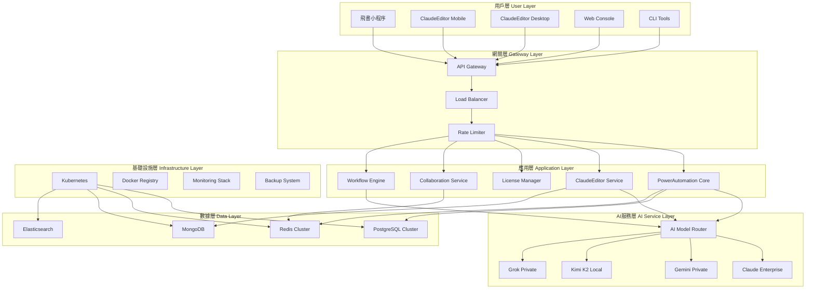
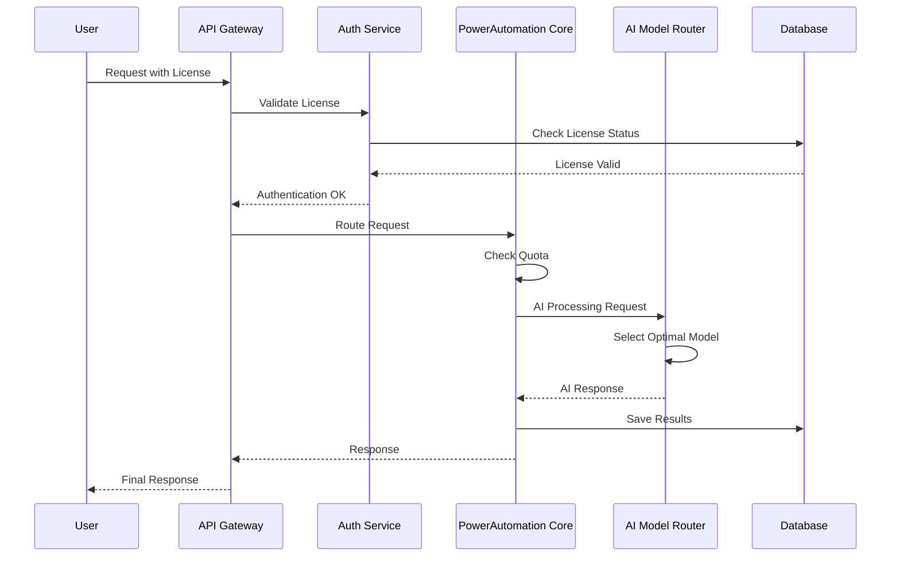
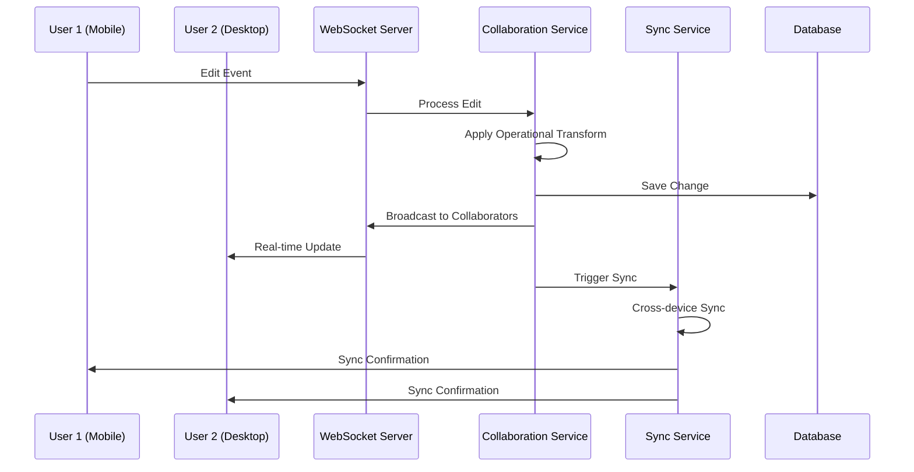
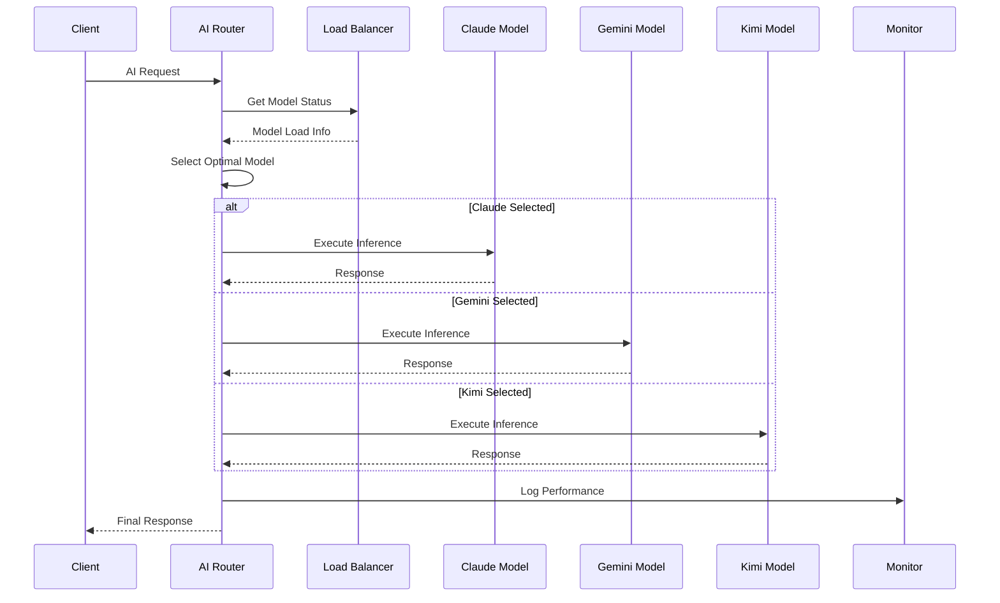

# 🏗️ PowerAutomation + ClaudeEditor 系統架構設計

本文檔詳細描述 PowerAutomation + ClaudeEditor 整合系統的技術架構設計，包括核心組件、數據流、安全機制和擴展性設計。

---

## 🎯 架構設計原則

### 核心設計理念
- 🔧 **模塊化設計**: 高內聚、低耦合的微服務架構
- 🚀 **高性能**: 支持數千併發用戶的高性能計算
- 🛡️ **安全第一**: 企業級安全保障和數據保護
- 📈 **可擴展性**: 水平擴展和彈性伸縮能力
- 🔄 **容錯設計**: 高可用性和故障自動恢復
- 🌍 **跨平台**: 統一的API和數據模型

---

## 🏗️ 整體架構概覽

### 系統架構圖



### 架構分層說明

#### 1. 用戶層 (User Layer)
負責用戶交互和界面展示
- **飛書小程序**: 購買入口和用戶管理
- **ClaudeEditor Mobile**: iOS/Android 移動端編輯器
- **ClaudeEditor Desktop**: Windows/macOS/Linux 桌面端編輯器
- **Web Console**: 管理控制台和儀表板
- **CLI Tools**: 命令行工具集

#### 2. 網關層 (Gateway Layer)
處理請求路由、限流和安全
- **API Gateway**: 統一API入口和路由
- **Load Balancer**: 負載均衡和流量分發
- **Rate Limiter**: 速率限制和配額控制

#### 3. 應用層 (Application Layer)
核心業務邏輯處理
- **PowerAutomation Core**: 核心業務邏輯和MCP組件
- **ClaudeEditor Service**: 編輯器後端服務
- **License Manager**: 許可證管理和驗證
- **Collaboration Service**: 實時協作功能
- **Workflow Engine**: 工作流執行引擎

#### 4. AI服務層 (AI Service Layer)
AI模型管理和推理
- **AI Model Router**: 智能模型路由和負載均衡
- **Claude Enterprise**: Claude企業版私有部署
- **Gemini Private**: Gemini私有實例
- **Kimi K2 Local**: Kimi K2本地部署
- **Grok Private**: Grok私有集成

#### 5. 數據層 (Data Layer)
數據存儲和管理
- **PostgreSQL Cluster**: 主要業務數據存儲
- **Redis Cluster**: 緩存和會話存儲
- **MongoDB**: 文檔和非結構化數據
- **Elasticsearch**: 日誌和搜索引擎

#### 6. 基礎設施層 (Infrastructure Layer)
底層基礎設施支撐
- **Kubernetes**: 容器編排和管理
- **Docker Registry**: 鏡像倉庫
- **Monitoring Stack**: 監控和告警
- **Backup System**: 備份和恢復

---

## 🔧 核心組件詳細設計

### PowerAutomation Core 架構

```typescript
interface PowerAutomationCore {
  // 模塊管理
  moduleManager: ModuleManager;
  
  // MCP組件
  mcpComponents: {
    codeflow: CodeFlowMCP;
    smartui: SmartUIMCP;
    test: TestMCP;
    agui: AGUIMCP;
    xmasters: XMastersMCP;
    operations: OperationsMCP;
    // ... 其他8個組件
  };
  
  // 工作流引擎
  workflowEngine: WorkflowEngine;
  
  // 許可證管理
  licenseManager: LicenseManager;
  
  // 配額管理
  quotaManager: QuotaManager;
  
  // 事件系統
  eventBus: EventBus;
}

class PowerAutomationCoreImpl implements PowerAutomationCore {
  constructor(config: CoreConfig) {
    this.initializeModules(config);
    this.setupEventHandlers();
    this.validateLicense(config.license);
  }
  
  async executeWorkflow(request: WorkflowRequest): Promise<WorkflowResult> {
    // 許可證驗證
    await this.licenseManager.validate(request.userId);
    
    // 配額檢查
    await this.quotaManager.checkAndConsume(request.userId, 'workflow_execution');
    
    // 執行工作流
    return await this.workflowEngine.execute(request);
  }
}
```

### ClaudeEditor Service 架構

```typescript
interface ClaudeEditorService {
  // 編輯器核心
  editorCore: EditorCore;
  
  // 文件管理
  fileManager: FileManager;
  
  // 協作服務
  collaborationService: CollaborationService;
  
  // 同步服務
  syncService: SyncService;
  
  // Claude Code集成
  claudeCodeIntegration: ClaudeCodeIntegration;
}

class ClaudeEditorServiceImpl implements ClaudeEditorService {
  async createProject(request: CreateProjectRequest): Promise<Project> {
    // 權限檢查
    await this.checkPermissions(request.userId, 'project.create');
    
    // 創建項目
    const project = await this.fileManager.createProject(request);
    
    // 設置協作
    if (request.collaboration) {
      await this.collaborationService.setupProject(project.id);
    }
    
    // 觸發同步
    await this.syncService.syncProject(project);
    
    return project;
  }
  
  async realTimeEdit(editRequest: EditRequest): Promise<void> {
    // 實時編輯廣播
    await this.collaborationService.broadcast(editRequest);
    
    // 保存變更
    await this.fileManager.saveChanges(editRequest);
    
    // 跨設備同步
    await this.syncService.syncChanges(editRequest);
  }
}
```

### AI Model Router 架構

```typescript
interface AIModelRouter {
  // 模型管理
  modelManager: ModelManager;
  
  // 負載均衡
  loadBalancer: LoadBalancer;
  
  // 健康檢查
  healthChecker: HealthChecker;
  
  // 性能監控
  performanceMonitor: PerformanceMonitor;
}

class AIModelRouterImpl implements AIModelRouter {
  async routeRequest(aiRequest: AIRequest): Promise<AIResponse> {
    // 選擇最佳模型
    const model = await this.selectOptimalModel(aiRequest);
    
    // 健康檢查
    const isHealthy = await this.healthChecker.check(model);
    if (!isHealthy) {
      model = await this.selectFallbackModel(aiRequest);
    }
    
    // 執行推理
    const response = await this.executeInference(model, aiRequest);
    
    // 記錄性能指標
    await this.performanceMonitor.record(model, aiRequest, response);
    
    return response;
  }
  
  private async selectOptimalModel(request: AIRequest): Promise<AIModel> {
    const criteria = {
      userEdition: request.userEdition,
      taskType: request.taskType,
      modelPreferences: request.preferences,
      currentLoad: await this.loadBalancer.getCurrentLoad()
    };
    
    return this.modelManager.selectModel(criteria);
  }
}
```

---

## 🔄 數據流設計

### 用戶請求流程



### 實時協作數據流



### AI模型推理流程



---

## 🛡️ 安全架構設計

### 安全層次架構

```yaml
Security Layers:
  Network Security:
    - VPC私有網絡
    - 防火牆規則
    - DDoS防護
    - 入侵檢測系統
    
  Application Security:
    - JWT Token認證
    - OAuth 2.0授權
    - API Rate Limiting
    - 輸入驗證和過濾
    
  Data Security:
    - AES-256數據加密
    - TLS 1.3傳輸加密
    - 數據庫加密存儲
    - 備份加密
    
  Access Control:
    - RBAC角色權限
    - 最小權限原則
    - 多因素認證
    - 會話管理
    
  Compliance:
    - 審計日誌記錄
    - 數據合規檢查
    - 隱私保護機制
    - 安全策略執行
```

### 許可證安全機制

```typescript
interface LicenseSecurityManager {
  // 許可證加密
  encryptLicense(license: License): EncryptedLicense;
  
  // 許可證驗證
  validateLicense(license: string): Promise<ValidationResult>;
  
  // 防篡改檢查
  checkIntegrity(license: string): boolean;
  
  // 時間戳驗證
  validateTimestamp(license: string): boolean;
}

class LicenseSecurityManagerImpl implements LicenseSecurityManager {
  async validateLicense(licenseKey: string): Promise<ValidationResult> {
    try {
      // 1. 解密許可證
      const decryptedLicense = await this.decrypt(licenseKey);
      
      // 2. 驗證簽名
      const signatureValid = await this.verifySignature(decryptedLicense);
      if (!signatureValid) {
        return { valid: false, reason: 'Invalid signature' };
      }
      
      // 3. 檢查過期時間
      const isExpired = this.checkExpiration(decryptedLicense);
      if (isExpired) {
        return { valid: false, reason: 'License expired' };
      }
      
      // 4. 驗證設備綁定
      const deviceValid = await this.validateDevice(decryptedLicense);
      if (!deviceValid) {
        return { valid: false, reason: 'Device not authorized' };
      }
      
      // 5. 檢查使用次數
      const usageValid = await this.validateUsage(decryptedLicense);
      if (!usageValid) {
        return { valid: false, reason: 'Usage limit exceeded' };
      }
      
      return { 
        valid: true, 
        edition: decryptedLicense.edition,
        features: decryptedLicense.features 
      };
      
    } catch (error) {
      return { valid: false, reason: 'Validation error' };
    }
  }
}
```

---

## 📊 性能優化設計

### 緩存策略

```typescript
interface CacheStrategy {
  // 多級緩存
  l1Cache: MemoryCache;      // 應用內緩存
  l2Cache: RedisCache;       // 分布式緩存
  l3Cache: DatabaseCache;    // 數據庫緩存
  
  // CDN緩存
  cdnCache: CDNCache;        // 靜態資源緩存
}

class CacheManager implements CacheStrategy {
  async get(key: string): Promise<any> {
    // L1 緩存檢查
    let data = await this.l1Cache.get(key);
    if (data) return data;
    
    // L2 緩存檢查
    data = await this.l2Cache.get(key);
    if (data) {
      await this.l1Cache.set(key, data, 300); // 5分鐘
      return data;
    }
    
    // L3 數據庫查詢
    data = await this.l3Cache.get(key);
    if (data) {
      await this.l2Cache.set(key, data, 1800); // 30分鐘
      await this.l1Cache.set(key, data, 300);  // 5分鐘
      return data;
    }
    
    return null;
  }
  
  async invalidate(pattern: string): Promise<void> {
    await Promise.all([
      this.l1Cache.invalidate(pattern),
      this.l2Cache.invalidate(pattern),
      this.l3Cache.invalidate(pattern)
    ]);
  }
}
```

### 數據庫優化

```sql
-- 核心表結構優化
CREATE TABLE users (
    id UUID PRIMARY KEY DEFAULT gen_random_uuid(),
    email VARCHAR(255) UNIQUE NOT NULL,
    license_key VARCHAR(255) UNIQUE,
    edition VARCHAR(50) NOT NULL,
    created_at TIMESTAMP WITH TIME ZONE DEFAULT NOW(),
    updated_at TIMESTAMP WITH TIME ZONE DEFAULT NOW()
);

-- 索引優化
CREATE INDEX CONCURRENTLY idx_users_license_key ON users(license_key);
CREATE INDEX CONCURRENTLY idx_users_edition ON users(edition);
CREATE INDEX CONCURRENTLY idx_users_created_at ON users(created_at);

-- 分區表設計（按時間分區）
CREATE TABLE audit_logs (
    id BIGSERIAL,
    user_id UUID REFERENCES users(id),
    action VARCHAR(100) NOT NULL,
    details JSONB,
    created_at TIMESTAMP WITH TIME ZONE DEFAULT NOW()
) PARTITION BY RANGE (created_at);

-- 創建月度分區
CREATE TABLE audit_logs_2024_01 PARTITION OF audit_logs
    FOR VALUES FROM ('2024-01-01') TO ('2024-02-01');

-- 查詢優化示例
WITH user_stats AS (
    SELECT 
        u.edition,
        COUNT(*) as user_count,
        AVG(quota_usage.daily_ai_requests) as avg_ai_usage
    FROM users u
    LEFT JOIN quota_usage qu ON u.id = qu.user_id
    WHERE u.created_at >= NOW() - INTERVAL '30 days'
    GROUP BY u.edition
)
SELECT * FROM user_stats ORDER BY user_count DESC;
```

### AI模型性能優化

```python
class AIModelOptimizer:
    def __init__(self):
        self.model_cache = ModelCache()
        self.batch_processor = BatchProcessor()
        self.gpu_scheduler = GPUScheduler()
    
    async def optimize_inference(self, requests: List[AIRequest]) -> List[AIResponse]:
        # 1. 請求批處理
        batches = self.batch_processor.create_batches(requests)
        
        # 2. GPU資源調度
        gpu_allocation = await self.gpu_scheduler.allocate(batches)
        
        # 3. 模型預熱
        await self.warmup_models(gpu_allocation)
        
        # 4. 並行推理
        results = await asyncio.gather(*[
            self.process_batch(batch, gpu_id)
            for batch, gpu_id in zip(batches, gpu_allocation)
        ])
        
        # 5. 結果合併
        return self.merge_results(results)
    
    async def process_batch(self, batch: Batch, gpu_id: int) -> List[AIResponse]:
        # GPU上下文切換
        with self.gpu_scheduler.context(gpu_id):
            # 模型加載（帶緩存）
            model = await self.model_cache.get_model(batch.model_type, gpu_id)
            
            # 批量推理
            return await model.batch_inference(batch.requests)
```

---

## 🔄 擴展性設計

### 水平擴展架構

```yaml
Horizontal Scaling Strategy:
  API Layer:
    - 無狀態服務設計
    - 負載均衡器自動擴展
    - 容器化部署
    
  Application Layer:
    - 微服務架構
    - 服務發現機制
    - 自動伸縮策略
    
  Database Layer:
    - 讀寫分離
    - 分庫分表
    - 數據分片策略
    
  AI Model Layer:
    - 模型實例池
    - 動態負載均衡
    - GPU資源池管理
```

### Kubernetes擴展配置

```yaml
# PowerAutomation Core自動擴展
apiVersion: autoscaling/v2
kind: HorizontalPodAutoscaler
metadata:
  name: powerautomation-core-hpa
spec:
  scaleTargetRef:
    apiVersion: apps/v1
    kind: Deployment
    name: powerautomation-core
  minReplicas: 3
  maxReplicas: 50
  metrics:
  - type: Resource
    resource:
      name: cpu
      target:
        type: Utilization
        averageUtilization: 70
  - type: Resource
    resource:
      name: memory
      target:
        type: Utilization
        averageUtilization: 80
  behavior:
    scaleDown:
      stabilizationWindowSeconds: 300
      policies:
      - type: Percent
        value: 50
        periodSeconds: 60
    scaleUp:
      stabilizationWindowSeconds: 60
      policies:
      - type: Percent
        value: 100
        periodSeconds: 60
      - type: Pods
        value: 5
        periodSeconds: 60
---
# AI模型自動擴展
apiVersion: autoscaling/v2
kind: HorizontalPodAutoscaler
metadata:
  name: ai-models-hpa
spec:
  scaleTargetRef:
    apiVersion: apps/v1
    kind: Deployment
    name: ai-model-cluster
  minReplicas: 2
  maxReplicas: 20
  metrics:
  - type: Resource
    resource:
      name: nvidia.com/gpu
      target:
        type: Utilization
        averageUtilization: 80
  - type: Pods
    pods:
      metric:
        name: ai_inference_queue_length
      target:
        type: AverageValue
        averageValue: "10"
```

---

## 📋 監控和可觀測性

### 監控架構

```yaml
Monitoring Stack:
  Metrics Collection:
    - Prometheus: 指標收集和存儲
    - Grafana: 可視化儀表板
    - AlertManager: 告警管理
    
  Logging:
    - ELK Stack: 日誌收集和分析
    - Fluentd: 日誌轉發
    - Kibana: 日誌查詢界面
    
  Tracing:
    - Jaeger: 分布式追踪
    - OpenTelemetry: 追踪數據收集
    
  APM:
    - 應用性能監控
    - 錯誤追踪
    - 用戶體驗監控
```

### 關鍵指標定義

```typescript
interface SystemMetrics {
  // 業務指標
  business: {
    activeUsers: number;
    dailyApiRequests: number;
    licenseValidationRate: number;
    collaborationSessions: number;
  };
  
  // 性能指標
  performance: {
    apiResponseTime: number;
    aiInferenceLatency: number;
    databaseQueryTime: number;
    cacheHitRate: number;
  };
  
  // 資源指標
  resources: {
    cpuUtilization: number;
    memoryUsage: number;
    gpuUtilization: number;
    diskIOPS: number;
  };
  
  // 可用性指標
  availability: {
    systemUptime: number;
    errorRate: number;
    successfulDeployments: number;
    mttr: number; // Mean Time To Recovery
  };
}
```

---

## 🎯 架構設計總結

PowerAutomation + ClaudeEditor 的技術架構設計實現了：

### 🏗️ 架構優勢
1. **🔧 模塊化設計**: 微服務架構確保系統的可維護性和擴展性
2. **🚀 高性能**: 多級緩存和GPU加速實現優異性能
3. **🛡️ 企業級安全**: 全方位安全保障滿足企業需求
4. **📈 可擴展性**: 水平擴展能力支持業務快速增長
5. **🔄 高可用性**: 容錯設計和自動恢復機制

### 🎯 技術創新點
1. **🔗 統一集成**: 飛書→PowerAutomation→ClaudeEditor的無縫集成
2. **🤖 智能路由**: AI模型的智能選擇和負載均衡
3. **📱 跨平台同步**: 移動端和桌面端的實時數據同步
4. **🏢 企業私有雲**: 完全私有化的AI模型部署
5. **📊 數據驅動**: 全面的監控和分析體系

### 📈 性能指標
- **⚡ API響應時間**: <200ms
- **🤖 AI推理延遲**: <2s
- **👥 併發支持**: 10,000+ 用戶
- **📊 系統可用性**: 99.9%+
- **🔄 數據同步延遲**: <500ms

這個架構設計為 PowerAutomation + ClaudeEditor 提供了堅實的技術基礎，確保系統能夠滿足從個人開發者到大型企業的各種需求。